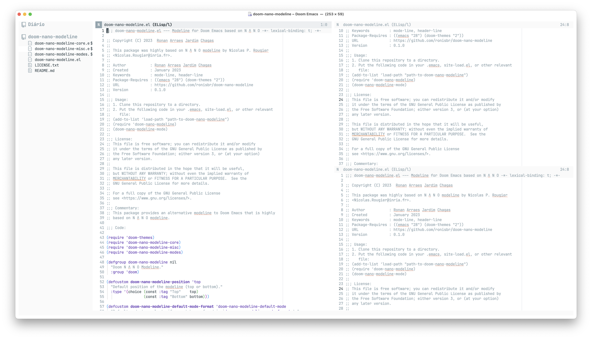

# Doom N Λ N O Modeline

This package contains an attempt to port [N Λ N O
Modeline](https://github.com/rougier/nano-modeline) to Doom Emacs. It has the
same design principle as the original one, but adapted to work correctly with
Doom Emacs and Evil mode.

## Installation

This package is not in MELPA yet. The recommended way to install it is using
`use-package` as follows.

Add the following code in your `packages.el`:

```emacs-lisp
(package! doom-nano-modeline
  :recipe (:host github
  :repo "ronisbr/doom-nano-modeline"))
```

And the following code in you `config.el`:

``` emacs-lisp
(use-package! doom-nano-modeline
  :config
  (doom-nano-modeline-mode 1)
  (global-hide-mode-line-mode 1))
```

It is also recommended to disable the module `modeline` in the section `ui` of
your `init.el`.

# Screenshot

The following image shows a screenshot of Doom Emacs using this package with the
Doom N Λ N O theme.



## Customization

The package provides some faces to customize its design. Check the available
options under the group name `doom-nano-modeline-`.

### Customizing Major Modes

If you want to customize the modeline in a particular mode, you need to add a
new entry to the variable `doom-nano-modeline-mode-formats`. This new entry must
be a property list with the following entries:

- `mode-p` (**REQUIRED**): A function that returns `t` if the are in the desired
  mode or `nil` otherwise.
- `format` (**REQUIRED**): A function that returns the decorated string to be
  rendered in the modeline. Check the helper function
  `doom-nano-modeline--render` that provides an easier interface to create this
  string.
- `on-activate` (**OPTIONAL**): A function that will be run when the modeline is
  loaded.
- `on-inactivate` (**OPTIONAL**): A functions that will be run when the modeline
  is deactivated.

### Appending Information to the Right Side

The user can append information to the mode-line right side, which will be shown
to the left of the cursor position. In this case, we need to provide a function
to the custom variable `doom-nano-modeline-append-information` that must return
a list in which each element is:

```
(text . face)
```

where `text` will be rendered using `face`. Hence, if the user wants to show,
for example, the buffer encoding, they can do:

```emacs-lisp
(defun get-buffer-encoding ()
  "Return the encoding of the current buffer."
  (let* ((sys (coding-system-plist buffer-file-coding-system))
         (cat (plist-get sys :category))
         (sym (if (memq cat
                        '(coding-category-undecided coding-category-utf-8))
                  'utf-8
                (plist-get sys :name)))
         (str (upcase (symbol-name sym))))
    `((,str . font-lock-comment-face)
      (" " . nil))))

(setq doom-nano-modeline-append-information #'get-buffer-encoding)
```

